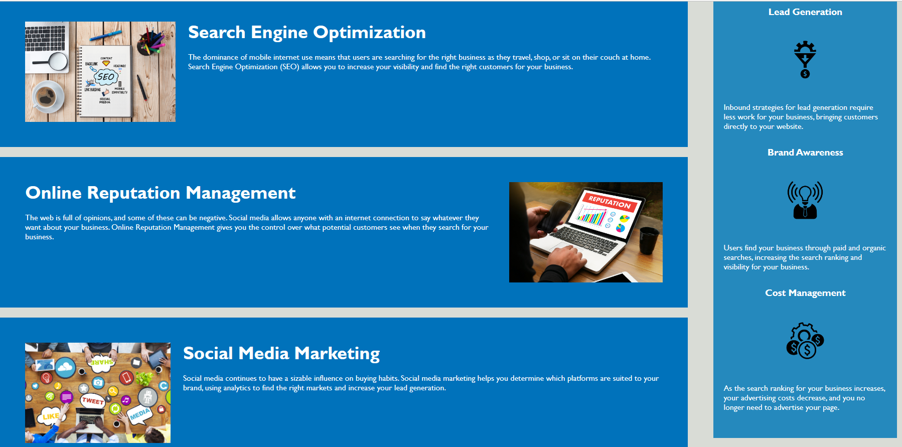

# Module 1 Challenge

## Overview:
* Developer: Donna Thompson
* Challenge type: Refactoring existing code for Horiseon website
* Goal of modifications: Ensure that accessibility standards are met.
* Benefit of modifications: The website will be optimized for search engines.

<br/>

## Summary of modifications:
* Added alt attributes for image and icon elements
* Ordered header attributes in proper sequence
* Combined redundant code on the style sheet
* substituted div for semantic elements where possible
* need more semantic elements?
* more concise descriptive title?


<br/>

## Link to deployed application:
[donnathompson7.github.io/Module1-Challenge](https://donnathompson7.github.io/Module1-Challenge)

<br/>

## Agile requirements:
### User Story

```
  AS A marketing agency
  I WANT a codebase that follows accessibility standards
  SO THAT our own site is optimized for search engines
```

### Acceptance Criteria

```
  GIVEN a webpage meets accessibility standards
  WHEN I view the source code
  THEN I find semantic HTML elements
  WHEN I view the structure of the HTML elements
  THEN I find that the elements follow a logical structure independent of styling and positioning
  WHEN I view the icon and image elements
  THEN I find accessible alt attributes
  WHEN I view the heading attributes
  THEN they fall in sequential order
  WHEN I view the title element
  THEN I find a concise, descriptive title
```

<br/>

## Screenshot of website homepage:

